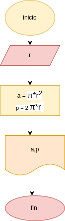

# programa 1: area_perimetro_circulo
programa en painton para calcular el area y el perimetro de un circulo, dado el valor de su radio

## Analisis 

### Variables de entrada
- r: radio del circulo 

### procesamiento 
- a: area del circulo 
- P: perimetro del circulo 

$a = \pi*r*^2$

$p = 2*\pi*r$

## Diseño 

## Construccion 
- codigo implementado en archivo area_perimetro_circ.py 